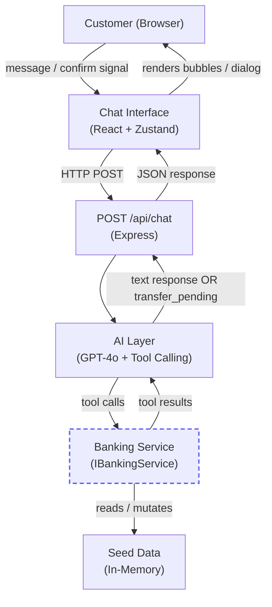

# Design Document: AskMyBank

## Overview

AskMyBank is a React + Node.js prototype that lets customers interact with their banking data through a natural-language chat interface. The AI Layer runs on the backend, calls four mocked banking tools, and returns structured responses or transfer-pending actions to the frontend. All banking data is in-memory; no authentication or database is required.

The three customer workflows are **KNOW** (balance inquiry), **UNDERSTAND** (spending summary), and **ACT** (transfer between accounts). The prototype is intentionally scoped for a three-hour build while demonstrating a clean, MCP-ready service boundary.

---

## Architecture



**MCP-ready boundary**: `IBankingService` is the only interface the AI Layer touches. Swapping `MockBankingService` for an authenticated MCP client requires no changes to the AI Layer or Chat Interface.

The full tool-call loop (send message → receive tool_calls → execute tools → re-submit results → receive final response) runs entirely on the backend. The frontend never calls banking operations directly.

---

## Project Structure

```
ask-my-bank/
├── client/
│   ├── src/
│   │   ├── components/
│   │   │   ├── ChatPage.tsx
│   │   │   ├── MessageList.tsx
│   │   │   ├── MessageBubble.tsx
│   │   │   ├── InputBar.tsx
│   │   │   ├── ConfirmationDialog.tsx
│   │   │   └── SuggestedChips.tsx
│   │   ├── store/
│   │   │   └── chatStore.ts
│   │   ├── types/
│   │   │   └── index.ts
│   │   ├── App.tsx
│   │   └── main.tsx
│   ├── index.html
│   ├── tailwind.config.ts
│   └── vite.config.ts
├── server/
│   ├── src/
│   │   ├── banking/
│   │   │   ├── IBankingService.ts
│   │   │   ├── MockBankingService.ts
│   │   │   └── seedData.ts
│   │   ├── ai/
│   │   │   ├── aiLayer.ts
│   │   │   ├── toolDefinitions.ts
│   │   │   └── systemPrompt.ts
│   │   ├── routes/
│   │   │   └── chat.ts
│   │   └── index.ts
│   └── tsconfig.json
├── docs/
│   ├── product-overview.md
│   ├── architecture.md
│   ├── api-contracts.md
│   ├── ai-usage.md
│   ├── design-system.md
│   ├── security-notes.md
│   ├── limitations.md
│   └── next-steps.md
├── .env.example
├── package.json
└── README.md
```

---

## Technology Decisions

| Technology | Justification |
|---|---|
| React 18 + TypeScript | Industry-standard UI with strong typing; no setup overhead given Vite scaffolding |
| Vite | Sub-second HMR eliminates rebuild wait time during a 3-hour build |
| Tailwind CSS v3 + Joy token extension | Utility-first styling maps Joy design tokens directly to class names without a component library |
| Zustand | Single-file store setup; no boilerplate compared to Redux |
| @phosphor-icons/react | Joy-specified icon library; tree-shakeable, typed |
| Node.js + Express + TypeScript | Minimal server with zero-config TypeScript via tsx |
| OpenAI GPT-4o with tool calling | Native function-calling removes custom intent-parsing logic; model selects tools automatically |
| In-memory seed data | Eliminates all database setup time; mutations persist for the session lifetime |
| tsx watch | Hot-reload backend without a separate build step during development |

---

## Data Models

```typescript
// Shared between client and server — source of truth in client/src/types/index.ts

export type AccountType = "checking" | "savings";
export type TransactionDirection = "credit" | "debit";

export interface Account {
  accountId: string;        // e.g. "chk-001"
  name: string;             // e.g. "Checking"
  type: AccountType;
  balance: number;          // two decimal places
  currency: string;         // ISO 4217, e.g. "USD"
}

export interface Transaction {
  transactionId: string;    // e.g. "txn-001"
  date: string;             // ISO 8601 date string
  description: string;      // max 255 chars
  amount: number;           // two decimal places, always positive
  direction: TransactionDirection;
  category: string;
}

export interface ChatMessage {
  id: string;
  role: "user" | "assistant";
  content: string;
  timestamp: string;        // ISO 8601
}

export interface TransferResult {
  transactionId: string;
  fromAccountId: string;
  toAccountId: string;
  amount: number;
  fromNewBalance: number;
  toNewBalance: number;
  timestamp: string;        // ISO 8601
}

export interface BankingServiceError {
  error: "ACCOUNT_NOT_FOUND" | "INSUFFICIENT_FUNDS" | "INVALID_AMOUNT";
  message: string;
}

// Frontend-only: drives the ConfirmationDialog
export interface PendingTransfer {
  fromAccountId: string;
  fromAccountName: string;
  toAccountId: string;
  toAccountName: string;
  amount: number;
}

// POST /api/chat — request body
export interface ChatRequest {
  messages: ChatMessage[];
  confirmTransfer?: PendingTransfer; // present only on confirmation POST
}

// POST /api/chat — response body
export interface ChatResponse {
  message: ChatMessage;
  transferPending?: PendingTransfer; // present when AI detects transfer intent
}
```

---

## Banking Service Interface

### TypeScript Interface

```typescript
// server/src/banking/IBankingService.ts

export interface IBankingService {
  getAccounts(): Promise<Account[]>;
  getBalance(accountId: string): Promise<Account | BankingServiceError>;
  getTransactions(
    accountId: string,
    startDate?: string,
    endDate?: string
  ): Promise<Transaction[] | BankingServiceError>;
  transferBetweenAccounts(
    fromAccountId: string,
    toAccountId: string,
    amount: number
  ): Promise<TransferResult | BankingServiceError>;
}
```

### Mock Implementation Strategy

`MockBankingService` holds a single in-memory `accounts` map and a `transactions` array. On construction it loads from `seedData.ts`. On a successful `transferBetweenAccounts` call it mutates both account balances in-place so subsequent `getBalance` calls reflect the new state.

```typescript
// Simplified mock skeleton
export class MockBankingService implements IBankingService {
  private accounts: Map<string, Account> = new Map(seedAccounts);
  private transactions: Transaction[] = seedTransactions;

  async getAccounts() { return Array.from(this.accounts.values()); }

  async getBalance(accountId: string) {
    return this.accounts.get(accountId) ?? { error: "ACCOUNT_NOT_FOUND", message: `No account found for id: ${accountId}` };
  }

  async getTransactions(accountId, startDate?, endDate?) {
    if (!this.accounts.has(accountId))
      return { error: "ACCOUNT_NOT_FOUND", message: `No account found for id: ${accountId}` };
    return this.transactions.filter(t =>
      t.accountId === accountId &&
      (!startDate || t.date >= startDate) &&
      (!endDate   || t.date <= endDate)
    );
  }

  async transferBetweenAccounts(fromAccountId, toAccountId, amount) {
    const from = this.accounts.get(fromAccountId);
    const to   = this.accounts.get(toAccountId);
    if (!from) return { error: "ACCOUNT_NOT_FOUND", message: `No account found for id: ${fromAccountId}` };
    if (!to)   return { error: "ACCOUNT_NOT_FOUND", message: `No account found for id: ${toAccountId}` };
    if (from.balance < amount) return { error: "INSUFFICIENT_FUNDS", message: `Insufficient funds: available $${from.balance.toFixed(2)}, requested $${amount.toFixed(2)}` };
    from.balance = parseFloat((from.balance - amount).toFixed(2));
    to.balance   = parseFloat((to.balance   + amount).toFixed(2));
    return { transactionId: `txn-${Date.now()}`, fromAccountId, toAccountId, amount, fromNewBalance: from.balance, toNewBalance: to.balance, timestamp: new Date().toISOString() };
  }
}
```

### MCP-Ready Swapping

Each operation maps to a single MCP tool call; swapping the module replaces only the I/O transport layer:

| Operation | MCP swap note |
|---|---|
| `getAccounts` | Replace with MCP `accounts/list` tool call |
| `getBalance` | Replace with MCP `accounts/balance` tool call, passing `accountId` |
| `getTransactions` | Replace with MCP `transactions/list` tool call, passing `accountId` + date range |
| `transferBetweenAccounts` | Replace with MCP `transfers/create` tool call, passing three parameters |

---

## Seed Data

```typescript
// server/src/banking/seedData.ts
// Dates are relative to current month. Replace YYYY-MM with actual current year-month at runtime.

export const seedAccounts: Account[] = [
  { accountId: "chk-001", name: "Checking", type: "checking", balance: 2450.00, currency: "USD" },
  { accountId: "sav-001", name: "Savings",  type: "savings",  balance: 8200.00, currency: "USD" },
];

export const seedTransactions: Transaction[] = [
  // Checking — current month debits (supports UNDERSTAND workflow, REQ-004)
  { transactionId: "txn-001", accountId: "chk-001", date: "YYYY-MM-03", description: "Whole Foods Market",    amount: 67.42, direction: "debit",  category: "Groceries"    },
  { transactionId: "txn-002", accountId: "chk-001", date: "YYYY-MM-08", description: "Netflix",               amount: 15.99, direction: "debit",  category: "Subscriptions" },
  { transactionId: "txn-003", accountId: "chk-001", date: "YYYY-MM-12", description: "Shell Gas Station",     amount: 52.10, direction: "debit",  category: "Gas"           },
  { transactionId: "txn-004", accountId: "chk-001", date: "YYYY-MM-01", description: "Direct Deposit Payroll", amount: 3200.00, direction: "credit", category: "Income"     },
  // Savings — at least 1 transaction (supports KNOW workflow, REQ-001)
  { transactionId: "txn-005", accountId: "sav-001", date: "YYYY-MM-05", description: "Interest Credit",        amount: 12.50, direction: "credit", category: "Interest"     },
];
```

**Verification against REQ-001:**
- Two accounts ✓ — Checking ($2,450.00) and Savings ($8,200.00)
- 3 categorized debit transactions in Checking this month ✓ — txn-001, 002, 003
- At least 1 transaction in Savings ✓ — txn-005
- Checking balance supports a $200 transfer ($2,450.00 ≥ $200.00) ✓

---

## API Routes

Only one route is needed. The Banking_Service is internal to the backend and is never exposed directly.

### `POST /api/chat`

**Request body:**
```json
{
  "messages": [
    { "id": "msg-1", "role": "user", "content": "What is my checking balance?", "timestamp": "2026-08-19T14:30:00Z" }
  ],
  "confirmTransfer": null
}
```

**Response — text reply:**
```json
{
  "message": {
    "id": "msg-2",
    "role": "assistant",
    "content": "Your Checking balance is $2,450.00.",
    "timestamp": "2026-08-19T14:30:01Z"
  }
}
```

**Response — transfer pending (AI detected transfer intent):**
```json
{
  "message": {
    "id": "msg-3",
    "role": "assistant",
    "content": "I found your accounts. Please review the transfer details below.",
    "timestamp": "2026-08-19T14:31:00Z"
  },
  "transferPending": {
    "fromAccountId": "chk-001",
    "fromAccountName": "Checking",
    "toAccountId": "sav-001",
    "toAccountName": "Savings",
    "amount": 200.00
  }
}
```

**Request body — customer confirms transfer:**
```json
{
  "messages": [...],
  "confirmTransfer": {
    "fromAccountId": "chk-001",
    "fromAccountName": "Checking",
    "toAccountId": "sav-001",
    "toAccountName": "Savings",
    "amount": 200.00
  }
}
```

---

## AI Layer Design

### System Prompt Strategy

```
server/src/ai/systemPrompt.ts
```

The system prompt establishes three rules:

1. **Grounding** — All financial facts (balances, transactions, transfer outcomes) must come from tool responses within the current session. Never estimate, invent, or recall values from prior turns.
2. **Tool-use-only for financial data** — Before stating any balance, transaction, or transfer result, call the appropriate banking tool. Do not answer financial questions from memory.
3. **Out-of-scope handling** — If a customer asks anything unrelated to their accounts or spending, respond: "I can only help with your account balances, spending history, and transfers between your accounts."

The prompt also instructs the model to return a structured JSON action `{ "action": "transfer_pending", ...params }` when it has verified sufficient funds and is ready to present the Confirmation_Dialog, rather than executing the transfer directly.

### Tool Definitions (OpenAI Function Calling Format)

```typescript
// server/src/ai/toolDefinitions.ts

export const tools = [
  {
    type: "function",
    function: {
      name: "getAccounts",
      description: "Returns all accounts for the customer. Use when the customer asks about all their accounts or does not specify an account.",
      parameters: { type: "object", properties: {}, required: [] }
    }
  },
  {
    type: "function",
    function: {
      name: "getBalance",
      description: "Returns the current balance for a specific account.",
      parameters: {
        type: "object",
        properties: {
          accountId: { type: "string", description: "The account ID, e.g. 'chk-001'" }
        },
        required: ["accountId"]
      }
    }
  },
  {
    type: "function",
    function: {
      name: "getTransactions",
      description: "Returns transactions for an account, optionally filtered by date range.",
      parameters: {
        type: "object",
        properties: {
          accountId: { type: "string" },
          startDate: { type: "string", description: "ISO 8601 date, e.g. '2026-08-01'" },
          endDate:   { type: "string", description: "ISO 8601 date, e.g. '2026-08-19'" }
        },
        required: ["accountId"]
      }
    }
  },
];
// Note: transferBetweenAccounts is NOT exposed as a tool to the AI.
// The AI signals intent via transfer_pending; the backend executes the transfer
// only after the frontend sends confirmTransfer.
// getBalance is reused by the transfer flow to verify source account funds
// before the AI returns a transfer_pending signal.
```

> `transferBetweenAccounts` is intentionally withheld from the AI's tool list. This ensures the customer's explicit confirmation in the frontend is the only trigger for fund movement.

### Tool Execution Loop

```
POST /api/chat received
  │
  â–¼
Build OpenAI messages array from request.messages
  │
  ├─ IF confirmTransfer present:
  │    Call bankingService.transferBetweenAccounts(...)
  │    Build assistant message from result (success or error)
  │    Return ChatResponse immediately
  │
  └─ ELSE:
       Send to GPT-4o with tool definitions
         │
         â–¼
       Receive response
         │
         ├─ IF finish_reason === "tool_calls":
         │    For each tool_call:
         │      Execute corresponding bankingService method
         │      Append tool result to messages
         │    Re-submit to GPT-4o (loop, max 5 iterations)
         │
         ├─ IF response content contains transfer_pending JSON:
         │    Parse transfer params
         │    Return ChatResponse { message, transferPending }
         │
         └─ IF finish_reason === "stop":
              Return ChatResponse { message }
```

### Transfer Confirmation Flow

1. Customer sends: `"Move $200 from checking to savings"`
2. AI Layer calls `getAccounts` → resolves account IDs
3. AI Layer calls `getBalance({ accountId: "chk-001" })` → verifies $2,450.00 ≥ $200.00
4. AI Layer returns `transferPending` in response (does NOT call `transferBetweenAccounts`)
5. Frontend stores `pendingTransfer` in Zustand → renders `ConfirmationDialog`
6. Customer clicks "Confirm Transfer"
7. Frontend sends `POST /api/chat` with `confirmTransfer` payload
8. Backend calls `bankingService.transferBetweenAccounts(...)` directly (bypasses AI loop)
9. Returns success/error `ChatResponse` to frontend

This design guarantees the customer's explicit action — not the AI — triggers fund movement.

---

## Frontend Component Architecture

### Component Tree

```
App
└── ChatPage
    ├── MessageList          (aria-live="polite")
    │   └── MessageBubble[]  (user | assistant variants)
    ├── SuggestedChips       (visible until first user message)
    ├── ConfirmationDialog   (rendered when pendingTransfer !== null)
    └── InputBar             (text input + send button)
```

### Zustand Store

```typescript
// client/src/store/chatStore.ts

interface ChatStore {
  messages: ChatMessage[];
  isLoading: boolean;
  pendingTransfer: PendingTransfer | null;
  error: string | null;

  sendMessage: (content: string) => Promise<void>;
  confirmTransfer: () => Promise<void>;
  cancelTransfer: () => void;
  clearError: () => void;
}
```

**State flow:**

- `isLoading: true` → disables `InputBar` and `SuggestedChips`, shows animated dots in assistant bubble area
- `pendingTransfer !== null` → renders `ConfirmationDialog`; `InputBar` remains disabled until dialog resolves
- `error !== null` → renders error alert in assistant bubble area; `InputBar` re-enabled

### ConfirmationDialog Behavior

- Mounts when `pendingTransfer` is set in the store
- Displays: from account name, to account name, formatted amount (`$200.00`)
- "Confirm Transfer" → calls `store.confirmTransfer()` → POST with `confirmTransfer` payload → clears `pendingTransfer`
- "Cancel" → calls `store.cancelTransfer()` → clears `pendingTransfer`, appends "Transfer cancelled" assistant message
- Escape key → same as Cancel (REQ-011 criterion 4)
- Focus trapped within dialog while open (REQ-011 criterion 3)

---

## UX Interaction States

### KNOW — Balance Inquiry

| Element | Joy Token | Notes |
|---|---|---|
| Balance amount | `heading-xl` `neutral-900` (positive) / `error-500` (negative) | REQ-003 criterion 2 |
| Account name label | `label-md` `neutral-600` | Precedes amount |
| Assistant bubble bg | `neutral-100` | REQ-002 criterion 1 |
| Assistant bubble text | `neutral-700` `body-md` | REQ-002 criterion 1 |
| ARIA | `aria-live="polite"` on MessageList | REQ-011 criterion 1 |

### UNDERSTAND — Spending Summary

| Element | Joy Token | Notes |
|---|---|---|
| Transaction description | `body-md` `neutral-700` | REQ-004 criterion 3 |
| Debit amount | `body-md` `error-500` | REQ-004 criterion 3 |
| Row divider | 1px `neutral-100` | REQ-004 criterion 3 |
| Category/merchant label | `label-sm` `neutral-400` | Groups summary rows |
| No-transactions message | `body-md` `neutral-700` in assistant bubble | REQ-004 criterion 4 |

### ACT — Transfer Flow

| State | Element | Joy Token | ARIA |
|---|---|---|---|
| Insufficient funds alert | Inline alert | `error-50` bg, `error-500` 2px left border, `label-md error-500` title, `body-sm neutral-700` body | `role="alert"` |
| ConfirmationDialog overlay | Overlay | `neutral-900` 50% opacity | `role="dialog"` `aria-modal="true"` |
| ConfirmationDialog container | Card | `neutral-0` bg, `radius-lg`, `shadow-lg` | `aria-labelledby` → dialog title |
| "Confirm Transfer" button | Primary button | `primary-500` bg, white text, `radius-md`, 40px height | Focus trapped inside dialog |
| "Cancel" button | Secondary button | white bg, `primary-500` text/border | — |
| Confirm loading state | Button | disabled, spinner, width preserved | `aria-busy="true"` |
| Success state icon | `CheckCircle` 48px | `success-500` | `aria-label="Transfer successful"` |
| Success state text | `body-md` `neutral-700` | Includes amount + destination | — |
| Error in dialog | Inline alert | `error-50` bg, 4px `error-500` left border | `role="alert"` |

### Loading / Error States

| State | Element | Joy Token | ARIA |
|---|---|---|---|
| AI processing | Animated 3-dot indicator | `neutral-400` dots in assistant bubble area | `aria-busy="true"` on bubble |
| Input disabled | InputBar + send button | `neutral-200` bg, `neutral-400` text | `aria-disabled="true"` |
| Timeout error | Assistant bubble | `error-50` bg, `error-500` border, `body-md neutral-700` | `role="alert"` |
| Generic error | Assistant bubble | `error-50` bg, `error-500` 4px left border | `role="alert"` |

---

## Workflow Traces

### KNOW: "What is my checking balance?"

1. Customer types "What is my checking balance?" → clicks send
2. Frontend appends user bubble, sets `isLoading: true`, disables InputBar
3. `POST /api/chat` → `{ messages: [...], confirmTransfer: null }`
4. AI Layer sends messages + tool definitions to GPT-4o
5. GPT-4o returns `tool_calls: [{ name: "getBalance", arguments: { accountId: "chk-001" } }]`
6. AI Layer calls `bankingService.getBalance("chk-001")`
7. Banking Service returns `{ accountId: "chk-001", name: "Checking", balance: 2450.00, currency: "USD" }`
8. AI Layer appends tool result, re-submits to GPT-4o
9. GPT-4o returns `finish_reason: "stop"`, content: `"Your Checking balance is **$2,450.00**."`
10. API returns `{ message: { role: "assistant", content: "..." } }`
11. Frontend appends assistant bubble; renders `$2,450.00` in `heading-xl neutral-900`; sets `isLoading: false`

### UNDERSTAND: "Where did my money go this month?"

1. Customer types "Where did my money go this month?" → sends
2. Frontend appends user bubble, sets `isLoading: true`
3. `POST /api/chat`
4. GPT-4o calls `getAccounts` (no account specified → clarify which account to use)
   - With only one spending-capable account (Checking), GPT-4o proceeds directly
5. GPT-4o calls `getTransactions({ accountId: "chk-001", startDate: "YYYY-MM-01", endDate: "YYYY-MM-DD" })`
6. Banking Service returns txn-001 (Groceries $67.42), txn-002 (Subscriptions $15.99), txn-003 (Gas $52.10)
7. AI Layer appends tool result, re-submits to GPT-4o
8. GPT-4o returns a grouped spending summary: Groceries $67.42, Subscriptions $15.99, Gas $52.10 — total $135.51
9. API returns `{ message: { role: "assistant", content: "..." } }`
10. Frontend renders assistant bubble with transaction rows: description `body-md neutral-700`, amounts `error-500`, 1px `neutral-100` dividers; `isLoading: false`

### ACT: "Move $200 from checking to savings"

1. Customer types "Move $200 from checking to savings" → sends
2. Frontend appends user bubble, sets `isLoading: true`
3. `POST /api/chat`
4. GPT-4o calls `getAccounts` → resolves "chk-001" (Checking) and "sav-001" (Savings)
5. GPT-4o calls `getBalance({ accountId: "chk-001" })` → $2,450.00 ≥ $200.00 ✓
6. GPT-4o returns structured `transfer_pending` signal in response content (not a tool call)
7. AI Layer parses `transferPending`, returns `ChatResponse { message, transferPending: { fromAccountId: "chk-001", fromAccountName: "Checking", toAccountId: "sav-001", toAccountName: "Savings", amount: 200.00 } }`
8. Frontend sets `pendingTransfer` in store → `ConfirmationDialog` mounts; focus trapped inside
9. Customer reviews: "Transfer $200.00 from Checking to Savings" → clicks "Confirm Transfer"
10. "Confirm Transfer" button shows loading spinner, is disabled
11. `POST /api/chat` with `confirmTransfer` payload
12. Backend bypasses AI loop → calls `bankingService.transferBetweenAccounts("chk-001", "sav-001", 200.00)`
13. Banking Service mutates balances: Checking → $2,250.00, Savings → $8,400.00; returns `TransferResult`
14. API returns `{ message: { role: "assistant", content: "Transfer complete. $200.00 has been moved to Savings." } }`
15. Frontend clears `pendingTransfer`; `ConfirmationDialog` unmounts; success message with `CheckCircle` 48px `success-500` rendered; `isLoading: false`

---

## Environment Configuration

| Variable | Location | Purpose |
|---|---|---|
| `OPENAI_API_KEY` | Server `.env` | Authenticates requests to the OpenAI API |
| `PORT` | Server `.env` | Port for the Express server (default: 3001) |
| `VITE_API_BASE_URL` | Client `.env` | Base URL the frontend uses for API calls (e.g. `http://localhost:3001`) |

A `.env.example` file at the repo root lists all three key names with placeholder values. No secret values appear in the codebase or documentation.

---

## Documentation Structure

The `README.md` at the repo root links to the following files in `docs/`:

| File | Contents |
|---|---|
| `docs/product-overview.md` | What AskMyBank is, the three customer workflows, and the prototype scope |
| `docs/architecture.md` | Component diagram, data flow narrative, MCP-ready boundary explanation |
| `docs/api-contracts.md` | `POST /api/chat` request/response shapes with representative JSON for all four banking operations |
| `docs/ai-usage.md` | System prompt strategy, tool definitions, tool-call loop, transfer_pending signal, grounding rules |
| `docs/design-system.md` | Joy token usage map: which tokens apply to which component states, with ARIA annotations |
| `docs/security-notes.md` | API key handling, no PII in mocked data, CORS configuration, prototype-only disclaimer |
| `docs/limitations.md` | In-memory only (no persistence), single-user session, no authentication, English-only NL understanding |
| `docs/next-steps.md` | Path to MCP integration, real auth, multi-user sessions, production deployment checklist |

---

## Components and Interfaces

This section is the canonical index of all interfaces and components defined in this document. Refer to the sections below for full definitions; this table cross-references file paths and where each interface is fully specified.

| Interface / Type | File | Defined In |
|---|---|---|
| `IBankingService` | `server/src/banking/IBankingService.ts` | [Banking Service Interface](#banking-service-interface) |
| `MockBankingService` | `server/src/banking/MockBankingService.ts` | [Banking Service Interface](#banking-service-interface) |
| `Account`, `Transaction`, `TransferResult`, `BankingServiceError` | `client/src/types/index.ts` | [Data Models](#data-models) |
| `ChatMessage`, `ChatRequest`, `ChatResponse`, `PendingTransfer` | `client/src/types/index.ts` | [Data Models](#data-models) |
| `ChatStore` | `client/src/store/chatStore.ts` | [Zustand Store](#zustand-store) |
| Tool definitions (OpenAI function calling) | `server/src/ai/toolDefinitions.ts` | [Tool Definitions](#tool-definitions-openai-function-calling-format) |

### Key Boundaries

- **`IBankingService`** is the only interface the AI Layer calls. All four operations (`getAccounts`, `getBalance`, `getTransactions`, `transferBetweenAccounts`) are defined there. Swapping `MockBankingService` for an MCP-compatible implementation requires no changes outside that file.
- **`ChatStore`** is the single source of truth for frontend state: `messages`, `isLoading`, `pendingTransfer`, and `error`. All UI components derive their render state from this store.
- **`ChatRequest` / `ChatResponse`** are the sole API contract between the frontend and backend. The presence or absence of `confirmTransfer` in `ChatRequest` determines whether the backend routes to the AI loop or the direct transfer path.

---

## Correctness Properties

The following invariants must hold at all times, derived from the requirements and transfer confirmation design.

### Property 1: Financial Grounding

**Validates: Requirements 2.3, 2.4, 3.1, 4.2**

Every balance, transaction list, or transfer outcome in an assistant bubble must originate from a Banking_Service tool call in the current session. The AI Layer must never answer a financial question from model memory.

### Property 2: No Phantom Execution

**Validates: Requirements 6.4, 7.1**

transferBetweenAccounts is called by the backend if and only if the incoming ChatRequest contains a non-null confirmTransfer payload. The AI Layer never calls this operation during the tool-calling loop.

### Property 3: Balance Consistency

**Validates: Requirements 7.3, 9.7**

After a successful transferBetweenAccounts call, fromNewBalance equals originalFromBalance minus amount and toNewBalance equals originalToBalance plus amount, with no floating-point rounding error. Subsequent getBalance calls reflect the updated values.

### Property 4: Idempotency of Read Operations

**Validates: Requirements 3.1, 4.1, 9.3, 9.4, 9.5**

getAccounts, getBalance, and getTransactions never modify the in-memory accounts map or transactions array. Calling them any number of times has no observable side effects on account state.

### Property 5: Error Containment

**Validates: Requirements 10.4, 9.8, 9.9**

A BankingServiceError (ACCOUNT_NOT_FOUND, INSUFFICIENT_FUNDS, INVALID_AMOUNT) must never propagate as an unhandled exception. It is always caught and surfaced as a human-readable assistant message in the ChatResponse.

---
## Error Handling

Error handling follows a layered strategy: typed errors at the service boundary, natural-language formatting in the AI Layer, and visual surfacing in the frontend store and message list.

### Banking_Service Errors

`MockBankingService` returns typed `BankingServiceError` objects for all failure cases rather than throwing:

| Error code | Trigger | AI Layer response |
|---|---|---|
| `ACCOUNT_NOT_FOUND` | `accountId` not in seed data | Assistant bubble: "I couldn't find that account." |
| `INSUFFICIENT_FUNDS` | Transfer amount > source balance | Inline alert (REQ-008): `error-50` bg, `error-500` 2px border, available balance stated |
| `INVALID_AMOUNT` | Amount ≤ 0 or > 999,999,999.99 | Assistant bubble: "Please provide a valid amount between $0.01 and $999,999,999.99." |

### Timeout

If the OpenAI API call or the tool-call loop does not resolve within 30 seconds (REQ-002 criterion 7), the Express route handler catches the timeout, returns an error `ChatResponse` to the frontend, and the `chatStore` re-enables the `InputBar`. For individual `Banking_Service` calls that exceed 10 seconds (REQ-003 criterion 5, REQ-010 criterion 3), the AI Layer treats the absence of a response as a failure and returns a service-unavailable message.

### Unhandled Exceptions

Express error middleware catches any unhandled exception in the route layer:

```typescript
app.use((err, req, res, next) => {
  console.error(err); // server-side only; never forwarded to client
  res.status(500).json({ error: "INTERNAL_ERROR", message: "Something went wrong." });
});
```

No stack traces, internal paths, or raw error messages are exposed to the client.

### Frontend Error Surface

All API errors are written to `chatStore.error`. The `MessageList` component reads this field and renders an error alert bubble (`error-50` background, `error-500` 4px left border, `role="alert"`) in the assistant bubble area. The `InputBar` is re-enabled once the error state is set, allowing the customer to retry.

---

## Testing Strategy

Appropriate for the three-hour prototype scope. No E2E automation framework is required.

### Unit Tests — `MockBankingService`

Target: `server/src/banking/MockBankingService.ts`

- **Balance mutation after transfer**: call `transferBetweenAccounts("chk-001", "sav-001", 200)`, then assert `getBalance("chk-001")` returns `2250.00` and `getBalance("sav-001")` returns `8400.00`.
- **Insufficient funds rejection**: call `transferBetweenAccounts` with an amount exceeding the source balance; assert the return value is `{ error: "INSUFFICIENT_FUNDS", ... }` and neither balance changes.
- **Account-not-found errors**: call `getBalance`, `getTransactions`, and `transferBetweenAccounts` with a non-existent `accountId`; assert each returns `{ error: "ACCOUNT_NOT_FOUND", ... }`.
- **Read idempotency**: call `getAccounts` and `getTransactions` multiple times; assert the seed data is unchanged after each call.

### Integration Tests — `POST /api/chat`

Target: `server/src/routes/chat.ts` with OpenAI client mocked (no real API calls)

- **`getBalance` routing**: send a message asking for a balance; assert the mocked OpenAI client is called with the `getBalance` tool definition and that the response contains the formatted balance.
- **`getTransactions` routing**: send a spending question; assert `getTransactions` is called with the correct `accountId` and current-month date range.
- **`transfer_pending` signal**: send a transfer intent message; assert the response body contains a non-null `transferPending` object and that `transferBetweenAccounts` was NOT called.
- **`confirmTransfer` triggers execution**: send a request with a non-null `confirmTransfer` payload; assert `transferBetweenAccounts` is called once with the correct parameters and the AI loop is bypassed.

### Manual Smoke Tests

Run each of the three customer workflow traces end-to-end in the browser using the seed data:

1. **KNOW**: "What is my checking balance?" → assert assistant bubble shows `$2,450.00` in `heading-xl`.
2. **UNDERSTAND**: "Where did my money go this month?" → assert three debit rows appear (Groceries, Subscriptions, Gas) with amounts in `error-500`.
3. **ACT**: "Move $200 from checking to savings" → confirm dialog appears → click "Confirm Transfer" → assert success state with `CheckCircle` icon and updated balance on a follow-up "What's my checking balance?" query.

