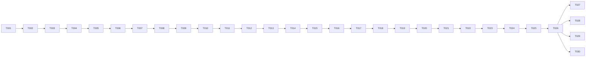

# Implementation Plan: AskMyBank

## Overview

This plan covers the full build of the AskMyBank prototype across nine phases, from project scaffolding through unit tests and documentation. All 30 tasks are required. Tasks are sequential — each one builds on the previous — grouped into tasks that deliver the three customer workflows (KNOW, UNDERSTAND, ACT) end-to-end (TASK-001–TASK-026) and tasks that deliver the documentation required to demonstrate and explain the prototype (TASK-027–TASK-030).

## Tasks

> Ordered task list for a 3-hour prototype build. Tasks are sequential — each one builds on the previous. All tasks are required: TASK-001–TASK-026 deliver the three working customer workflows, TASK-027–TASK-030 deliver the required documentation.

---

## Phase 1 — Project Setup

### TASK-001 · Scaffold monorepo structure
**Required**
Initialize the `ask-my-bank/` monorepo with two workspaces: `client/` (Vite + React 18 + TypeScript) and `server/` (Node.js + Express + TypeScript). Create the root `package.json` with workspace entries, `.env.example` listing `OPENAI_API_KEY`, `PORT`, and `VITE_API_BASE_URL`, and `.gitignore` covering `node_modules`, `.env`, and `dist`.
Satisfies: REQ-001, REQ-009

---

### TASK-002 · Install and configure server dependencies
**Required**
In `server/`, install: `express`, `cors`, `dotenv`, `openai` (pinned latest stable), `tsx` (dev). Add `tsconfig.json` targeting ES2022 with `moduleResolution: bundler`. Add `package.json` scripts: `dev` (tsx watch src/index.ts) and `build` (tsc).
Satisfies: REQ-009

---

### TASK-003 · Install and configure client dependencies
**Required**
In `client/`, install: `zustand`, `@phosphor-icons/react` (pinned). Confirm Vite scaffold includes `tailwindcss` v3, `postcss`, and `autoprefixer`. Initialize `tailwind.config.ts` with `content` paths covering `./src/**/*.{ts,tsx}`.
Satisfies: REQ-001, REQ-012

---

### TASK-004 · Extend Tailwind with Joy design tokens
**Required**
In `client/tailwind.config.ts`, extend the default theme with the full Nymbus Joy token set:
- **Colors**: all primary (50/100/500/600/700), neutral (0/50/100/200/400/600/700/900), success (50/500), warning (50/500), error (50/500), info (50/500) tokens mapped to their exact hex values from the steering file
- **Font size + line height**: heading-2xl through body-sm and label-md/sm tokens
- **Font weight**: map token names to numeric weights
- **Spacing**: space-1 through space-16 on the 4px grid
- **Border radius**: radius-sm/md/lg/xl/full
- **Box shadow**: shadow-sm/md/lg (placeholder values; mark as design debt pending foundations.pdf verification)
Do not use arbitrary values; all styling must resolve to a named token class.
Satisfies: REQ-012.5

---

### TASK-005 · Create shared TypeScript types
**Required**
Create `client/src/types/index.ts` with the canonical data model types exactly as specified in design.md: `AccountType`, `TransactionDirection`, `Account`, `Transaction`, `ChatMessage`, `TransferResult`, `BankingServiceError`, `PendingTransfer`, `ChatRequest`, `ChatResponse`. These types are the source of truth shared across all components and the server.
Satisfies: REQ-009.3, REQ-009.4, REQ-009.5, REQ-009.6

---

## Phase 2 — Banking Service

### TASK-006 · Create IBankingService interface
**Required**
Create `server/src/banking/IBankingService.ts` with the four method signatures exactly as specified in design.md: `getAccounts()`, `getBalance(accountId)`, `getTransactions(accountId, startDate?, endDate?)`, `transferBetweenAccounts(fromAccountId, toAccountId, amount)`. Import `Account`, `Transaction`, `TransferResult`, and `BankingServiceError` from a server-local copy of the shared types (or re-export from a shared path). This interface is the only contract the AI Layer touches.
Satisfies: REQ-009.1, REQ-009.2, REQ-009.10

---

### TASK-007 · Create seed data
**Required**
Create `server/src/banking/seedData.ts` with exactly two accounts (`chk-001` Checking $2,450.00 and `sav-001` Savings $8,200.00) and five transactions as specified in design.md. Transaction dates must be computed dynamically at module load time using the current year and month so they always fall in the current calendar month (e.g. `new Date().toISOString().slice(0, 7)` prefix). Export `seedAccounts` and `seedTransactions` arrays.
Satisfies: REQ-001.1, REQ-009.3, REQ-009.4, REQ-009.5

---

### TASK-008 · Implement MockBankingService
**Required**
Create `server/src/banking/MockBankingService.ts` implementing `IBankingService`. On construction, load `seedAccounts` into a `Map<string, Account>` and `seedTransactions` into an array. Implement all four operations:
- `getAccounts`: return `Array.from(this.accounts.values())`
- `getBalance`: return account or `ACCOUNT_NOT_FOUND` error
- `getTransactions`: filter by `accountId` and optional date range; return `ACCOUNT_NOT_FOUND` if account missing
- `transferBetweenAccounts`: validate both accounts exist, check sufficient funds, mutate both balances in-place with `parseFloat(...toFixed(2))`, return `TransferResult`; return typed errors without throwing
Satisfies: REQ-009.7, REQ-009.8, REQ-009.9

---

## Phase 3 — Backend AI Layer

### TASK-009 · Create Express server entry point
**Required**
Create `server/src/index.ts`: load `.env` via `dotenv/config`, instantiate `MockBankingService`, create Express app, configure `cors` (allow `VITE_API_BASE_URL` origin), parse JSON body, mount the chat router at `/api/chat`, add error middleware, and listen on `process.env.PORT ?? 3001`. Export the `bankingService` instance for use in routes.
Satisfies: REQ-002, REQ-010.4

---

### TASK-010 · Create system prompt
**Required**
Create `server/src/ai/systemPrompt.ts` exporting a `SYSTEM_PROMPT` string that encodes the three grounding rules from design.md:
1. All financial facts must come from Banking_Service tool responses in the current session — never from model memory.
2. Before stating any balance, transaction list, or transfer result, call the appropriate tool.
3. If asked anything outside accounts, spending, or transfers, respond: "I can only help with your account balances, spending history, and transfers between your accounts."

Also instruct the model: when transfer parameters are fully resolved and funds are verified sufficient, respond with a JSON object `{ "action": "transfer_pending", "fromAccountId": "...", "fromAccountName": "...", "toAccountId": "...", "toAccountName": "...", "amount": 0 }` instead of calling a tool — the backend will handle execution after customer confirmation.
Satisfies: REQ-002.3, REQ-002.4, REQ-005.2, REQ-006.4

---

### TASK-011 · Create tool definitions
**Required**
Create `server/src/ai/toolDefinitions.ts` exporting the `tools` array with exactly three OpenAI function-calling definitions as specified in design.md: `getAccounts` (no parameters), `getBalance` (accountId required), `getTransactions` (accountId required, startDate/endDate optional). Do NOT include `transferBetweenAccounts` — this is intentional and must be noted with an inline comment.
Satisfies: REQ-005.1, REQ-009.1

---

### TASK-012 · Implement AI Layer with tool execution loop
**Required**
Create `server/src/ai/aiLayer.ts` implementing `runAITurn(messages, bankingService, confirmTransfer?)`. 

- If `confirmTransfer` is present: call `bankingService.transferBetweenAccounts(...)` directly, format the result as an assistant `ChatMessage`, and return immediately — bypass the AI loop entirely.
- Otherwise: build the OpenAI messages array, call GPT-4o with `tools` and `tool_choice: "auto"`, loop up to 5 iterations:
  - On `finish_reason === "tool_calls"`: execute each tool call against `bankingService`, append results, re-submit.
  - On response content containing `"transfer_pending"` JSON: parse and return `{ message, transferPending }`.
  - On `finish_reason === "stop"`: return `{ message }`.
- Apply a 30-second total timeout; throw a typed error on timeout.
Satisfies: REQ-002.3, REQ-003.1, REQ-004.1, REQ-005.2, REQ-007.1

---

### TASK-013 · Create chat route
**Required**
Create `server/src/routes/chat.ts` with a single `POST /` handler. Validate that `messages` is a non-empty array. Call `aiLayer.runAITurn(messages, bankingService, req.body.confirmTransfer ?? null)`. On success, return `200` with a `ChatResponse` JSON body. On timeout, return `504`. On any other error, pass to error middleware. Assign a unique `id` (nanoid or `Date.now().toString()`) and ISO timestamp to the returned message.
Satisfies: REQ-002.7, REQ-003.1, REQ-004.1, REQ-006.4, REQ-007.1, REQ-010.3, REQ-010.4

---

## Phase 4 — Frontend Foundation

### TASK-014 · Create Zustand chat store
**Required**
Create `client/src/store/chatStore.ts` with the `ChatStore` interface exactly as specified in design.md: state fields `messages`, `isLoading`, `pendingTransfer`, `error`; actions `sendMessage(content)`, `confirmTransfer()`, `cancelTransfer()`, `clearError()`.
- `sendMessage`: append user bubble, set `isLoading: true`, POST to `/api/chat`, on success append assistant bubble and set `pendingTransfer` if present, on error set `error`, always set `isLoading: false`.
- `confirmTransfer`: POST with current `pendingTransfer` as `confirmTransfer` payload, clear `pendingTransfer` on success.
- `cancelTransfer`: clear `pendingTransfer`, append "Transfer cancelled." assistant bubble.
- `clearError`: set `error: null`.
Use `VITE_API_BASE_URL` from `import.meta.env` as the base URL.
Satisfies: REQ-002.2, REQ-002.5, REQ-006.3, REQ-007.1, REQ-010.2

---

### TASK-015 · Create App shell and ChatPage layout
**Required**
Create `client/src/App.tsx` rendering `<ChatPage />` inside a `<main>` element. Create `client/src/components/ChatPage.tsx` with a flex-column full-height layout: `MessageList` grows to fill space, `InputBar` fixed to bottom. Apply neutral-50 app background. On mobile (< 768px), input bar is fixed to viewport bottom. On desktop (≥ 1280px), constrain content to max-width 1280px centered with 24px margins.
Satisfies: REQ-012.1, REQ-012.4

---

## Phase 5 — Chat UI

### TASK-016 · Create MessageBubble component
**Required**
Create `client/src/components/MessageBubble.tsx` accepting `message: ChatMessage`. 
- User bubble: right-aligned, `bg-primary-500`, white text, `radius-md` corners, `body-md` font size, `space-3` padding.
- Assistant bubble: left-aligned, `bg-neutral-100`, `neutral-700` text, `radius-md` corners, `body-md` font size, `space-3` padding.
- Loading variant: assistant bubble containing the animated 3-dot indicator (three `neutral-400` dots pulsing with staggered animation; `aria-busy="true"`; respect `prefers-reduced-motion` by removing animation when set).
Satisfies: REQ-002.1, REQ-002.2, REQ-010.1, REQ-011.8

---

### TASK-017 · Create MessageList with aria-live
**Required**
Create `client/src/components/MessageList.tsx` that reads `messages` and `isLoading` from `chatStore`. Render the message list in a scrollable container with `aria-live="polite"` and `aria-label="Conversation"`. Render a `MessageBubble` for each message. When `isLoading` is true, render an additional loading-variant `MessageBubble` at the bottom. Auto-scroll to bottom when messages change. Only assistant bubbles are in the live region scope — user bubbles are added synchronously by the store and do not need announcement.
Satisfies: REQ-002.2, REQ-011.1, REQ-011.8

---

### TASK-018 · Create InputBar
**Required**
Create `client/src/components/InputBar.tsx`. Include a `<label htmlFor="chat-input">` (visually hidden via `sr-only`) and `<input id="chat-input">` pair satisfying REQ-011.5. On submit (Enter key or send button click), call `store.sendMessage(value.trim())` only if value has non-whitespace characters (REQ-002.5); clear the input and return focus to the field after submit. Disable input and send button when `isLoading` is true, styled with `neutral-200` bg and `neutral-400` text. Send button is icon-only (`PaperPlaneTilt` from Phosphor, 20px) with `aria-label="Send message"`. Full-width on mobile.
Satisfies: REQ-002.2, REQ-002.5, REQ-010.2, REQ-011.2, REQ-011.5, REQ-011.6, REQ-012.1

---

### TASK-019 · Create SuggestedChips
**Required**
Create `client/src/components/SuggestedChips.tsx` rendering two chips: "What's my balance?" and "Where did my money go this month?". Each chip is a secondary-sm button (white bg, `primary-500` text/border, 32px height, `label-sm`, `radius-md`). Visible only until the first user message exists in the store. On click, call `store.sendMessage(chipText)`. Disable chips when `isLoading` is true.
Satisfies: REQ-001.2, REQ-001.3, REQ-002.6

---

## Phase 6 — Transfer Flow

### TASK-020 · Create ConfirmationDialog
**Required**
Create `client/src/components/ConfirmationDialog.tsx`. Render when `pendingTransfer !== null` in the store. 

Structure:
- Overlay: `neutral-900` at 50% opacity, `role="dialog"`, `aria-modal="true"`, `aria-labelledby="dialog-title"`
- Container: `neutral-0` bg, `radius-lg`, `shadow-lg`, max-width 480px; on mobile full-width bottom sheet with `radius-xl` top corners
- Header: "Confirm Transfer" in `heading-lg` with id `dialog-title`
- Body: from account name, to account name, amount formatted as `$X.XX`, in `body-md` `neutral-700`
- Footer: "Cancel" secondary button (left) + "Confirm Transfer" primary button (right)

Behavior:
- On mount: move focus to the "Confirm Transfer" button
- Focus trap: Tab/Shift+Tab cycle only between Cancel and Confirm Transfer
- Escape key: call `store.cancelTransfer()`
- "Cancel" click: call `store.cancelTransfer()`
- "Confirm Transfer" click: call `store.confirmTransfer()`; show loading spinner on button, disable both buttons, preserve button width while loading (`aria-busy="true"`)
- On dialog close: return focus to the element that triggered it
Satisfies: REQ-006.1, REQ-006.2, REQ-006.3, REQ-006.4, REQ-006.5, REQ-011.3, REQ-011.4, REQ-011.6

---

### TASK-021 · Add transfer success state
**Required**
In `ConfirmationDialog.tsx` (or a sibling `TransferSuccess.tsx` rendered in its place), handle the post-confirmation success state: when `confirmTransfer` resolves successfully and the assistant message is appended, dismiss the dialog and render a success state in the chat. The success assistant bubble must include a `CheckCircle` icon at 48px in `success-500` (with `aria-label="Transfer successful"`), a confirmation message including the transferred amount and destination account name in `body-md` `neutral-700`, and a "Back to Accounts" ghost button that calls `store.clearError()` and scrolls to top of message list.
Satisfies: REQ-007.2, REQ-007.3

---

### TASK-022 · Add insufficient-funds alert and error/retry state
**Required**
In the assistant bubble rendered when the AI returns an insufficient-funds response, render a Joy-spec inline alert: `error-50` bg, `error-500` 2px left border, `radius-md`, `space-4` padding, title "Insufficient funds" in `label-md` `error-500`, body in `body-sm` `neutral-700` stating the available balance with a suggestion to reduce the amount or choose a different account. This alert is rendered as part of the normal message flow (no dialog), so `role="alert"` is required. If `confirmTransfer` returns an error from the backend, display a similar error alert inside the dialog per REQ-006.6, and offer retry (re-calls `store.confirmTransfer()`) and cancel buttons.
Satisfies: REQ-008.1, REQ-008.2, REQ-008.3, REQ-006.6

---

## Phase 7 — Joy Polish

### TASK-023 · Apply balance typography and spending summary styles
**Required**
Ensure all rendered financial data uses the correct Joy tokens:
- **Balance display** (in assistant bubbles from KNOW workflow): amount in `heading-xl` (24px/700), `neutral-900` for positive/zero, `error-500` for negative; account name label in `label-md` `neutral-600` preceding the amount.
- **Spending summary rows** (UNDERSTAND workflow): description in `body-md` `neutral-700`; debit amount in `body-md` `error-500`; credit amount in `body-md` `success-500`; 1px `neutral-100` bottom divider between rows; category/merchant label in `label-sm` `neutral-400`.

Parse the assistant message content in `MessageBubble` to detect structured balance and transaction data (the AI Layer should return these in a parseable format), or instruct the AI via system prompt to use a lightweight markdown structure the bubble can style.
Satisfies: REQ-003.2, REQ-004.3

---

### TASK-024 · Apply button, input, and disabled-state tokens
**Required**
Audit all interactive elements and confirm token compliance:
- Primary button: `bg-primary-500` hover `bg-primary-600` active `bg-primary-700`, white text, `radius-md`
- Secondary button: white bg, `primary-500` text and 1px border, hover `primary-50` bg
- Focus ring: 2px `primary-500` outline, 2px offset on all focusable elements — never removed
- Disabled inputs and buttons: `neutral-200` bg, `neutral-400` text, `cursor-not-allowed`
- Form input (InputBar): 40px height, `neutral-200` 1px border default, `primary-500` 2px border on focus, `radius-sm`, `body-md` `neutral-900` text, `neutral-400` placeholder
- Confirm `prefers-reduced-motion` disables all decorative animations (loading dots, any transitions)
Satisfies: REQ-010.2, REQ-011.7, REQ-011.8, REQ-012.5

---

### TASK-025 · Welcome message and session initialization UX
**Required**
In `ChatPage.tsx`, render a welcome assistant bubble on mount (before any user message) containing: a greeting of ≤ 160 characters, and the `SuggestedChips`. The welcome message should appear immediately at load — it does not require an API call. Ensure the input field accepts keyboard focus within 2 seconds of load (no async blocking). If `chatStore` fails to initialize (network error on first load), display an error alert with `error-50` background disabling input until resolved.
Satisfies: REQ-001.2, REQ-001.3, REQ-001.4

---

## Phase 8 — Unit Tests

### TASK-026 · Unit tests for MockBankingService
**Required**
Create `server/src/banking/MockBankingService.test.ts` using Vitest. Implement all four test cases from the Testing Strategy section of design.md:

1. **Balance mutation after transfer**: call `transferBetweenAccounts("chk-001", "sav-001", 200)`, then assert `getBalance("chk-001")` returns `2250.00` and `getBalance("sav-001")` returns `8400.00`.
2. **Insufficient funds rejection**: call `transferBetweenAccounts` with amount exceeding source balance; assert return value has `error: "INSUFFICIENT_FUNDS"` and neither balance changed.
3. **Account-not-found errors**: call `getBalance`, `getTransactions`, and `transferBetweenAccounts` with a non-existent `accountId`; assert each returns `{ error: "ACCOUNT_NOT_FOUND" }`.
4. **Read idempotency**: call `getAccounts` twice and `getTransactions("chk-001")` twice; assert seed data is unchanged after each call and both calls return identical results.

Each test must instantiate a fresh `MockBankingService` so tests are isolated.
Satisfies: REQ-009.7, REQ-009.8, REQ-009.9 (design.md Testing Strategy)

---

## Phase 9 — Documentation

### TASK-027 · Write README
**Required**
Create `README.md` at the repo root with: project description, prerequisites (Node 20+, OpenAI API key), setup steps (`npm install`, copy `.env.example` to `.env`, fill in key), `npm run dev` instructions for starting both client and server, links to all `docs/` files.
Satisfies: REQ-009 (documentation quality)

---

### TASK-028 · Write docs/product-overview.md and docs/architecture.md
**Required**
Create `docs/product-overview.md`: what AskMyBank is, the three customer workflows (KNOW/UNDERSTAND/ACT), prototype scope and constraints.
Create `docs/architecture.md`: component diagram (text-based Mermaid or ASCII), data flow narrative for each workflow, explanation of the MCP-ready boundary at `IBankingService`.
Satisfies: REQ-009 (documentation quality)

---

### TASK-029 · Write docs/api-contracts.md and docs/ai-usage.md
**Required**
Create `docs/api-contracts.md`: `POST /api/chat` request/response shapes with representative JSON for all four scenarios (balance, spending, transfer_pending, confirmTransfer). Include all four `Banking_Service` operation contracts verbatim from REQ-009.
Create `docs/ai-usage.md`: system prompt strategy, tool definitions (with explanation of why `transferBetweenAccounts` is excluded), tool-call loop steps, `transfer_pending` signal format, grounding rules.
Satisfies: REQ-009 (documentation quality)

---

### TASK-030 · Write remaining docs
**Required**
Create `docs/design-system.md`: Joy token usage map keyed by component state with ARIA annotations.
Create `docs/security-notes.md`: API key in `.env` only, no PII in mocked data, CORS config, prototype-only disclaimer.
Create `docs/limitations.md`: in-memory only (no persistence), single-user session, no auth, English-only NL.
Create `docs/next-steps.md`: MCP integration path, real auth, multi-user sessions, production deployment checklist.
Satisfies: REQ-009 (documentation quality)

---

## Task Summary

| Phase | Tasks | Type | Target time |
|---|---|---|---|
| 1 — Project Setup | TASK-001 – TASK-005 | Required | ~25 min |
| 2 — Banking Service | TASK-006 – TASK-008 | Required | ~20 min |
| 3 — Backend AI Layer | TASK-009 – TASK-013 | Required | ~30 min |
| 4 — Frontend Foundation | TASK-014 – TASK-015 | Required | ~15 min |
| 5 — Chat UI | TASK-016 – TASK-019 | Required | ~25 min |
| 6 — Transfer Flow | TASK-020 – TASK-022 | Required | ~20 min |
| 7 — Joy Polish | TASK-023 – TASK-025 | Required | ~15 min |
| 8 — Unit Tests | TASK-026 | Required | ~10 min |
| 9 — Documentation | TASK-027 – TASK-030 | Required | ~20 min |
| **Total (required)** | **30 tasks** | | **~180 min** |

**Required tasks**: TASK-001 through TASK-030 (all three workflows, documentation, and API/tool contracts)

## Task Dependency Graph



```json
{
  "waves": [
    ["TASK-001", "TASK-002", "TASK-003", "TASK-004", "TASK-005"],
    ["TASK-006", "TASK-007", "TASK-008"],
    ["TASK-009", "TASK-010", "TASK-011", "TASK-012", "TASK-013"],
    ["TASK-014", "TASK-015"],
    ["TASK-016", "TASK-017", "TASK-018", "TASK-019"],
    ["TASK-020", "TASK-021", "TASK-022"],
    ["TASK-023", "TASK-024", "TASK-025"],
    ["TASK-026"],
    ["TASK-027", "TASK-028", "TASK-029", "TASK-030"]
  ]
}
```

## Notes

- All 30 tasks are required. TASK-001–TASK-026 deliver the three working customer workflows (KNOW, UNDERSTAND, ACT). TASK-027–TASK-030 deliver the documentation required to demonstrate and explain the prototype.
